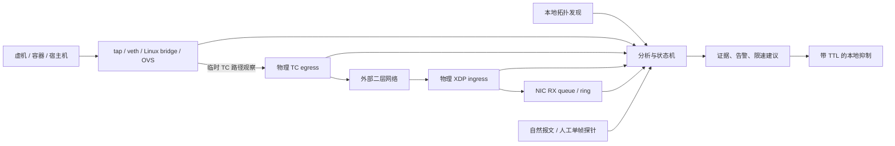

# 二层环路检测 Agent 设计方案

日期：2026-08-06  
状态：产品设计基线；已实现只读预检、隔离安全挂载、隔离被动累计观测和有界固定速率窗口
实现语言：Rust + eBPF/XDP/TC  
范围：独立物理 Agent，不依赖 Neutron，不进行跨节点通信

当前实现边界比完整产品设计更窄：只允许生成的隔离 network namespace/veth 会话，已实现单层 VLAN 二层分类、XDP ingress/TC egress 按 generation 累计 packets/bytes、真实 `observe/status`、身份精确回滚，以及 daemon 内存中的 1 Hz 后台采样和固定 1/10/60 秒 PPS/BPS 窗口。每个 generation 最多保留 64 个成功样本；请求读取不进入采样序列；超过 3 秒才 stale；非 ready 窗口不输出数值速率。Observation schema 为 2，控制协议仍为 1。100 ms 采样、持久化历史、动态基线、指纹、环路状态机、证据包、主动探针、限速及生产/物理接口挂载仍是后续阶段，不能把本文件中的完整产品能力理解为当前可用命令。

## 1. 设计结论

二层环路检测 Agent 将实现为常驻 Rust 服务。管理员显式指定物理接口后，Agent 持续观察物理入口、物理出口、NIC/内核资源和本地二层拓扑。

首期工作模式为：

```text
默认被动观察
  -> 确认风暴
  -> 判断来源与环路特征
  -> 生成证据并告警
  -> 管理员可手工执行单帧探针
  -> 管理员可手工开启带 TTL 的本地限速
  -> TTL 到期自动回到 Observe
```

高 PPS、RX drop 或 `rx_out_of_buffer` 只能证明风暴和资源耗尽，不能单独证明环路。只有路径重复、唯一探针返回或等价强证据才能升级为确认状态。

## 2. 目标与非目标

### 2.1 目标

- 在指定物理接口识别入口、出口和双向风暴。
- 判断 RX queue/ring、softnet 和 CPU softirq 是否被压垮。
- 区分外部灌入、本地异常源、内部闭环和混合闭环。
- 对自然报文建立有界指纹，发现复制放大和本地重复路径。
- 通过管理员手工单帧探针确认二层返回路径。
- 保存足以复盘和定责的证据包。
- 在管理员授权后执行本地、可过期、可审计、可回退的限速。

### 2.2 非目标

首期不提供：

- 跨节点关联或全网拓扑推理；
- 自动定位外部交换机/防火墙的完整端口路径；
- 自动修改 STP、RSTP、MLAG、LACP 或防火墙 HA 配置；
- 周期性主动探针；
- 自动关闭本地 tap、veth、OVS 或物理端口；
- 默认自动限速；
- 与 Neutron 生命周期或端口模型耦合；
- 以高 PPS、MAC Top-N 或 RX drop 单信号直接宣称环路确认。

## 3. 能力边界

单节点 Agent 能确认“本机看到什么、从哪里先出现、是否在本地路径重复、探针是否返回”。它无法仅凭一个物理入口的被动帧，百分之百区分：

```text
设备主动发送 1,000,000 个完全相同的帧
一个帧进入外部二层环路后被复制 1,000,000 次
```

因此产品必须区分：

- 已确认的风暴事实；
- 环路疑似；
- 环路高置信；
- 二层返回路径确认；
- 环路确认；
- 原因未知。

## 4. 总体架构



模块：

1. 接口与挂载管理器；
2. XDP ingress 观察与入口 policer；
3. TC egress 观察与出口 policer；
4. NIC/内核资源采集器；
5. 本地二层拓扑发现器；
6. 指纹与自然探针引擎；
7. 人工单帧探针；
8. 判定状态机；
9. 证据存储与审计；
10. 本地 CLI。

## 5. 接口与运行模型

### 5.1 显式接口

```bash
l2-loopctl observe --interface bond1
```

Agent 不自动推断 OVS uplink。配置必须显式列出可观察接口和可执行限速的接口。

建议首期策略：

| 接口 | 观察 | 人工限速 |
|---|---:|---:|
| provider/业务网络（如 bond1） | 是 | 是 |
| 管理网络（如 bond0） | 是 | 否 |
| tap/veth/bridge/OVS 内部口 | 疑似事件期间临时观察 | 首期否 |
| 其他物理口 | 显式白名单后启用 | 显式白名单后启用 |

### 5.2 bond

用户以 bond master 为操作对象。Agent 必须解析 master/slave 和 active slave：

- XDP 挂载到真正接收数据的 slave；
- bond 切换时重新核验挂载身份；
- 避免同时在 master 与 slave 重复统计或重复执法；
- 状态输出同时显示逻辑接口和实际挂载接口；
- 最终挂载矩阵必须在目标内核和 bond mode 上实测后冻结。

### 5.3 生命周期

- 记录 ifindex、接口 generation、程序 ID、link ID 和实际 attach mode。
- pinned path 存在不等于程序仍正确挂载。
- 接口删除、重建或 ifindex 复用时不得继承旧策略。
- 保护域状态缺失时 fail-open，但状态必须标记 degraded。

## 6. 物理接口观察

### 6.1 XDP ingress

XDP 在进入 OVS、TC 和主机协议栈前统计：

```text
总 PPS/BPS
广播 PPS/BPS
IPv4 multicast
IPv6 multicast
其他 multicast
ARP
DHCP
IPv6 RS / RA / NS / NA
包长分布
VLAN（可见时）
源/目的 MAC
EtherType
报文指纹采样
RX queue
```

XDP 也是外部入口风暴的最终本地 policer。

### 6.2 TC egress

TC egress 默认只观察：

```text
本机发出的 PPS/BPS
BUM 类别
源/目的 MAC
VLAN
报文指纹
首次出现时间
```

它的作用是确定时间方向：

- ingress 先升高：更像外部灌入；
- egress 先升高且源 MAC 属于本机：更像本地源；
- 本地发出后同指纹从 ingress 放大返回：更像内部种子触发外部复制或混合闭环。

### 6.3 NIC 与内核

周期读取：

```text
rx_packets / rx_bytes
rx_dropped / rx_missed_errors
rx_no_buffer / rx_out_of_buffer
每个 RX queue 的 packet/drop
/proc/net/softnet_stat dropped / time_squeeze
NET_RX softirq
IRQ 与 CPU affinity
CPU softirq 使用率
```

`rx_out_of_buffer` 增长表示 descriptor 回收速度赶不上入口报文，不等于 ring 配置一定太小。

## 7. 风暴识别

时间窗口：

```text
100 ms：突发、增长斜率、局部 queue 打满
1 s：PPS/BPS、BUM 占比、指纹重复度
60 s～5 min：正常基线
```

风暴条件组合：

```text
动态基线倍数
+ 绝对安全上限
+ 持续时间
```

不能对所有速率、链路和业务接口使用同一固定 PPS 阈值。

基础状态：

```text
NORMAL
INGRESS_STORM
EGRESS_STORM
BIDIRECTIONAL_STORM
```

资源严重度独立记录：

```text
NO_RESOURCE_PRESSURE
QUEUE_PRESSURE
RX_DROPPING
HOST_STACK_PRESSURE
```

## 8. 报文指纹与自然探针

对采样帧生成稳定、有界的指纹：

```text
VLAN
源/目的 MAC
EtherType
帧长度
IP 协议
ICMP/ICMPv6 类型
可用事务字段
前 64～96 字节的稳定哈希
```

统计：

- 总样本数和唯一指纹数；
- 单指纹重复次数；
- Top-N 指纹和源 MAC；
- BUM 占比；
- 首次/最后出现位置与时间；
- 重复间隔；
- ingress/egress 先后关系。

实现必须有界：

- 每包只做低成本分类计数；
- 详细指纹按比例采样，初始评估范围为 1/64～1/256；
- LRU 指纹表初始评估范围为 4,096～16,384 项；
- 最终值由目标内核/NIC 的 CPU、内存和准确性测试决定。

自然探针优先使用带唯一字段的报文：

```text
DHCP XID
IPv4 ID
TCP sequence
ICMP ID / sequence
随机 UDP payload
其他事务 ID
```

同一个唯一事务报文在极短时间内沿同一路径反复出现，是强复制证据。IPv6 RS 没有事务序号，只能依赖完整指纹、多源同步、路径循环和主动探针提高置信度。

## 9. 本地拓扑发现

Agent 默认只读发现：

```text
/sys/class/net
Netlink 接口关系
bond master/slave
Linux bridge 成员和 VLAN
veth peer
tap
network namespace
本地 FDB
```

检测到 OVS 时增加只读适配器：

```text
OVS bridge
Port / Interface
patch port 及其对端
tag / trunks / vlan_mode
bond
本地 MAC 学习位置
```

Agent 按 forwarding domain 和 VLAN 构图。正常逻辑关系不能误报为环：

- bond slaves 归并为一个逻辑端口；
- veth pair 是一条边；
- patch pair 是一条边；
- bridge master/member 表示转发关系；
- VLAN 不一致的边不能连接。

拓扑中存在同 VLAN 闭合路径时只输出：

```text
LOCAL_TOPOLOGY_CYCLE_CANDIDATE
```

静态闭环候选不等于正在转发，必须结合数据面证据。

## 10. 来源与环路类型判断

### 10.1 外部风暴

```text
物理 XDP ingress 首先升高
物理 TC egress 之前没有对应风暴
源 MAC 不属于本机
本地接口没有先出现对应指纹
```

输出：

```text
EXTERNAL_STORM_SOURCE
```

若同时具有低熵、高重复、多源同步和 BUM 放大特征，升级为外部环路疑似或高置信，但被动观察仍不能绝对确认。

### 10.2 本地异常源

```text
本地 tap/veth 或物理 TC egress 首先出现
源 MAC 属于本机
随后物理出口 PPS 升高
```

输出：

```text
LOCAL_STORM_SOURCE_CONFIRMED
```

这只确认源在本机，不自动等同于内部环路。

### 10.3 本地种子触发外部放大

```text
本地端口首先出现唯一指纹
  -> 物理 egress 发出
  -> 相同指纹从物理 XDP ingress 大量返回
  -> ingress 数量远大于原始 egress 数量
```

输出：

```text
LOCAL_SEED_EXTERNAL_AMPLIFICATION
```

### 10.4 内部环路

出现拓扑候选或本地源风暴后，Agent 进入短时诊断模式，在候选 tap/veth、bridge/OVS 内部口、patch port 和物理 egress 临时安装只观察 TC 采样。

每个事件记录：

```text
fingerprint
ifindex / interface
direction
VLAN
源/目的 MAC
timestamp
```

相同帧反复回到已经经过的本地“接口 + 方向”，形成重复路径时输出：

```text
LOCAL_LOOP_HIGH_CONFIDENCE
```

多个自然报文沿同一路径重复、循环延迟稳定、重复多轮以及内部/物理计数同步倍增，都会提高置信度。

### 10.5 混合闭环

路径表现为：

```text
本地发出 -> 外部返回 -> 再进入本地 bridge/OVS -> 再次发出
```

在数据面路径或主动探针确认后输出：

```text
HYBRID_LOOP_CONFIRMED
```

## 11. 人工单帧探针

### 11.1 安全不变量

```text
默认关闭
只能管理员手工触发
每次严格 1 帧
最大 count 硬编码为 1
禁止周期性探测
同接口/VLAN 冷却 60 秒
全节点每小时最多 10 次
先登记 nonce，后发送
返回帧计数后立即丢弃
完整审计
```

以太帧没有 TTL。即使只发送一帧，也可能在真实环路中被复制很多次，所以不能把“一帧”理解为零风险。

payload 至少包含：

```text
magic
version
node ID
128-bit nonce
timestamp
checksum
scope
```

使用独立本地管理源 MAC，不冒充业务 MAC，不生成响应帧。

### 11.2 外部探针

```bash
l2-loopctl probe \
  --interface bond1 \
  --vlan <VID> \
  --scope external \
  --timeout 2s
```

流程：

```text
登记 nonce
  -> 从指定物理 forwarding domain 发出一帧
  -> XDP ingress 匹配返回
  -> 返回帧计数并 XDP_DROP
  -> 超时删除状态
```

判定：

| 返回次数 | 结果 |
|---:|---|
| 0 | 未确认，不能排除 |
| 1 | `L2_RETURN_PATH_DETECTED` |
| 2 次及以上 | `L2_DUPLICATION_CONFIRMED` |
| 持续快速返回且存在 BUM 风暴 | `EXTERNAL_LOOP_CONFIRMED` |

### 11.3 内部探针

```bash
l2-loopctl probe \
  --interface bond1 \
  --vlan <VID> \
  --scope internal \
  --timeout 2s
```

Agent 根据物理接口反查关联 bridge/OVS forwarding domain，从已验证安全的本地注入点发送探针，在候选成员口观察：

- nonce 返回原观察位置：`LOCAL_L2_RETURN_PATH_CONFIRMED`；
- nonce 多次沿同一本地路径循环：`LOCAL_LOOP_CONFIRMED`。

如果无法安全确定注入点，命令必须拒绝执行，不能猜测接口。

## 12. 判定状态机

```text
NORMAL

INGRESS_STORM_CONFIRMED
EGRESS_STORM_CONFIRMED
BIDIRECTIONAL_STORM_CONFIRMED

EXTERNAL_LOOP_SUSPECTED
EXTERNAL_LOOP_HIGH_CONFIDENCE
EXTERNAL_LOOP_CONFIRMED

LOCAL_STORM_SOURCE_CONFIRMED
LOCAL_LOOP_SUSPECTED
LOCAL_LOOP_HIGH_CONFIDENCE
LOCAL_LOOP_CONFIRMED

LOCAL_SEED_EXTERNAL_AMPLIFICATION
HYBRID_LOOP_CONFIRMED
```

状态升级需要保存证据条件。信号消失时不能直接删除事件，应进入 cooldown，并保留完整时间线。

## 13. 本地抑制

### 13.1 外部入口风暴

在物理 XDP ingress 按有界键限速：

```text
接口
+ 可见 VLAN
+ BUM 类别
+ 协议
+ 可选源 MAC / 指纹
```

这只能保护本机，不能修复外部交换网络。

### 13.2 内部源风暴

首期优先在物理 TC egress 限速，避免本机继续污染外部网络：

```text
接口
+ VLAN
+ 源 MAC
+ 协议
```

在 tap/veth 上自动执法需要单独验证，首期不自动前移。

### 13.3 内部纯桥接环路

首期只告警并给出候选断环端口，不自动关闭接口。错误断口可能中断业务。

### 13.4 限速安全要求

- 必须有 TTL，到期自动回到 observe；
- 可查询、可审计、可手工提前撤销；
- Agent 异常 fail-open；
- BPDU、LACP、LLDP 等控制报文使用独立高保护预算；
- ARP、DHCP、NDP 不允许全部清零；
- 同时支持 PPS 和 BPS token bucket；
- observe 与 police 的 would-drop/drop 计数分离；
- 管理网络默认禁止 police。

## 14. VLAN 可见性

目标环境使用老内核，且 NIC 可能启用 RX VLAN offload。硬件剥离 VLAN tag 后，XDP 未必能看见 VLAN。

Agent 启动时必须发布：

```text
vlan_visibility=verified
vlan_visibility=unavailable
vlan_visibility=unknown
```

只有实包能力测试通过时，才允许：

- 输出按 VLAN 的检测结论；
- 发送带 VLAN 的主动探针；
- 安装按 VLAN 的 policer。

不可见时退化为接口、L2 类别、协议和 MAC 级观察，不得伪造 VLAN 结论。

## 15. 证据包

本节的落盘、告警、权限、容量和查询细节以
[`2026-08-06-local-alert-evidence-output-design.md`](superpowers/specs/2026-08-06-local-alert-evidence-output-design.md)
为准。证据存储是事件的权威记录；journald 只发布精简、可检索、尽力而为的结构化摘要；CLI 通过本地控制 socket 返回脱敏视图。

每个事件保存：

```text
逻辑接口、实际 slave、ifindex、attach mode
事件状态时间线
NIC/RX queue/ring 指标
softnet、IRQ、softirq 指标
ingress/egress PPS/BPS
BUM 与协议分类
VLAN 可见性与 VLAN
Top 源 MAC
Top 指纹、重复率、首次位置
本地 MAC/接口归属
本地二层拓扑快照
候选循环路径
自然探针路径
主动探针 nonce、返回次数和延迟
生效/建议的限速规则及 TTL
有大小和时长上限的小型 PCAP（默认关闭，显式配置后启用）
```

证据包采用版本化 manifest、完整性哈希和原子提交。默认总容量为 1 GiB、最多 1,000 个事件、保留 30 天；磁盘不足时先停止可选 PCAP，再淘汰最旧的已关闭事件，永不淘汰活跃事件。

完整 payload、源 MAC、IP、指纹、原始拓扑和 PCAP 不进入 journald 或普通组可查询的 CLI 摘要。监控平台指标、Prometheus 和 Alertmanager 当前不在范围内。

## 16. CLI 草案

```bash
# 开始观察
l2-loopctl observe --interface bond1

# 状态与证据
l2-loopctl status --interface bond1
l2-loopctl evidence list --limit 50
l2-loopctl evidence show --id <event-id>

# 人工单帧探针
l2-loopctl probe \
  --interface bond1 --vlan <VID> --scope external \
  --timeout 2s

# 人工带 TTL 限速
l2-loopctl police apply \
  --interface bond1 --vlan <VID> \
  --class ipv6-multicast --pps <limit> --ttl 10m

# 提前撤销
l2-loopctl police disable --rule <rule-id>
```

现有命令名由 Rust 基础实现规范固定。证据列表将在首次发布前增加有界分页和 opaque cursor；响应始终受一兆字节协议帧限制。

## 17. 与现有 XDP Storm/DDoS 设计的关系

参考设计 `2026-07-19-xdp-storm-ddos-guard-design.md` 提供了可复用原则：

- 单一 XDP entry、内部保护域隔离；
- explicit physical-interface allowlist；
- disabled / observe / police；
- 双 PPS/BPS token bucket；
- generation-scoped policy publication；
- 精确 link/program/interface readiness；
- 有界 map、per-CPU stats、fail-open degraded；
- observe-first 和性能门禁。

本设计的新增重点是：

- 环路证据分级，而不是只做 storm policer；
- 物理 TC egress 时间方向；
- 本地拓扑发现；
- 内部候选路径的临时 TC 观察；
- 自然报文探针；
- 外部/内部人工单帧探针；
- 外部、内部和混合闭环分类。

本独立 Agent 不继承 Neutron tap 生命周期，也不把物理接口伪装成 Neutron tap。

## 18. 实施阶段

### 阶段 1：只读基础

- Rust daemon 与本地 CLI；
- 显式接口和 bond 解析；
- XDP/TC 精确挂载身份；
- NIC/queue/softnet 指标；
- L2/VLAN/QinQ 解析；
- BUM/协议分类和 observe 计数；
- VLAN 可见性验证；
- bounded evidence store。

### 阶段 2：被动环路分析

- 指纹采样与 LRU；
- 动态基线和状态机；
- ingress/egress 先后关系；
- 本地 MAC 与接口归属；
- Linux bridge/OVS 拓扑图；
- 事件证据包。

### 阶段 3：内部路径诊断

- 候选端口的临时 TC 观察；
- 自然探针路径关联；
- 内部和混合闭环判定；
- 自动卸载临时观察 hook。

### 阶段 4：人工主动探针

- 安全注入点验证；
- nonce 注册、匹配和 drop；
- 硬编码 count/cooldown/hourly cap；
- 完整审计和拒绝条件。

### 阶段 5：人工抑制

- XDP ingress token bucket；
- TC egress token bucket；
- TTL、rollback、fail-open；
- 控制协议保护预算；
- observe 与 police 对照验证。

自动限速必须在长期 observe 数据、误判演练和回滚演练通过后另行审批。

## 19. 验证与验收

### 19.1 功能验证

- 正常广播/组播不误报；
- 单设备主动高 PPS 只判风暴，不误判为确认环路；
- 外部 veth/bridge 环路能达到 external high-confidence；
- 本地 Linux bridge/OVS 闭环能生成重复路径；
- 混合路径能按先后关系分类；
- 探针零返回不判无环；
- 探针返回被立即 drop，不进入协议栈；
- 无安全注入点时 internal probe 拒绝执行；
- TTL 到期自动解除限速；
- Agent 崩溃或状态缺失时 fail-open。

### 19.2 受控风暴模式回放验收

使用受控实验流量重现：

```text
IPv6 RS 占绝大多数
少数源 MAC
低熵、高指纹重复
入口达到受控测试设定的高 PPS
rx_out_of_buffer / drop 增长
```

期望 Agent 输出：

```text
INGRESS_STORM_CONFIRMED
EXTERNAL_LOOP_HIGH_CONFIDENCE
protocol=ICMPv6_RS
resource=RX_DROPPING
source_macs=<bounded top-N>
vlan=<VID>（仅在 visibility=verified 时）
```

若人工外部探针多次返回且风暴仍存在，再升级：

```text
EXTERNAL_LOOP_CONFIRMED
```

### 19.3 性能门禁

- disabled fast path 不低于改造前基线的 95%；
- observe 不低于基线的 90%；
- 单一热 storm class 的 police 不低于基线的 80%；
- 记录内核、NIC、driver/firmware、attach mode、队列数、CPU/IRQ affinity、帧长和 achieved PPS；
- 在目标企业内核上实测 verifier、map 和 helper 支持，不能仅按上游内核版本推断。

## 20. 开放问题

实现前仍需冻结：

1. crate、进程和 systemd 布局；
2. map ABI、generation 和持久化格式；
3. 100 ms 突发采样和后续证据历史容量；当前交付的 1 Hz、固定 1/10/60 秒窗口和 64 样本内存容量已经冻结；
4. 动态基线算法及每类绝对安全上限；
5. 各 bond mode 的 XDP/TC 挂载矩阵；
6. Linux bridge 与 OVS 的 internal probe 安全注入点；
7. 目标内核下 TC ingress/egress 与 XDP VLAN 元数据能力；
8. 主动探针和限速的管理员授权、审计与 RBAC 模型；只读状态和证据权限已由本地告警和证据输出规范冻结；
9. 只读事件何时建议 ingress、egress 或本地端口止血。

这些问题不改变已确认的产品边界：单节点、observe-first、证据分级、人工单帧探针、人工 TTL 限速。
